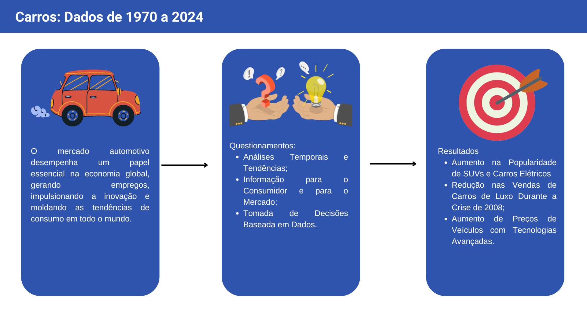

# DataDrivers

<div align="center">
  
</div>

## Análise e predição de Carros dos anos 70 a 2024

O objetivo deste projeto é realizar uma análise exploratória e prever tendências no mercado automotivo, com base em dados históricos de veículos fabricados entre 1970 e 2024. Pretende-se identificar padrões significativos e oferecer insights sobre as transformações tecnológicas, econômicas e sociais que impactaram o setor ao longo das décadas. Além disso, serão desenvolvidos modelos preditivos para auxiliar na compreensão de comportamentos futuros e apoiar decisões estratégicas de consumidores, fabricantes e outros stakeholders.

## Justificativa

O mercado automotivo desempenha um papel essencial na economia global, sendo um motor de inovação tecnológica e um reflexo das dinâmicas sociais e econômicas de diferentes períodos. Mudanças nas preferências dos consumidores, como o crescimento da popularidade de SUVs e carros elétricos, bem como os impactos de crises financeiras, como a redução nas vendas de carros de luxo, ilustram a relevância de analisar esses dados. Este projeto busca explorar essas transformações e fornecer informações úteis para decisões estratégicas no setor.

## Base de dados

A análise utiliza o dataset '90,000+ Cars Data From 1970 to 2024', disponível no [Kaggle]([https://github.com/Giselz](https://www.kaggle.com/datasets/meruvulikith/90000-cars-data-from-1970-to-2024?resource=download). A base reúne dados sobre características importantes, como modelo, ano de fabricação, preço, transmissão, quilometragem, tipo de combustível, taxa, consumo (mpg), tamanho do motor e fabricante, permitindo uma visão detalhada da evolução do mercado automotivo.

## Metodologia

A metodologia utilizada será a CRISP-DM, composto por:

1. Entendimento de negócio
2. Entendimento de dados
3. Preparação dos dados
4. Modelagem

## Etapas do projeto

### Dicionário de dados
Etapa de realização da coleta inicial de dados, com criação de um arquivo na pasta data/raw.
Criação do dicionário de dados, estrutura que servirá para explicar o dado, contendo as seguintes informações para cada uma das variáveis do conjunto de dados:
* variavel: nome da coluna no pandas
* descricao: descrição da coluna
* tipo: quantitativa ou qualitativa
* subtipo: nominal, ordinal, discreta, contínua

### Análise exploratória de dados
Criação de um notebook de análise exploratória notebooks/01-exploratory_data_analysis.ipynb, com as seguintes seções de texto:
* Descrição dos dados: informações sobre a quantidade de instâncias, variáveis e seus tipos, quantidade de valores faltantes. Utilize o dicionário de dados nessa seção.
* Perguntas de partida e hipóteses: que tipo de informações podem ser obtidas a partir dos dados e quais hipóteses podem ser levantadas?
* Insights: respostas às perguntas feitas na seção anterior e quais informações interessantes podem ser levantadas através dos dados?

### Análise comparativa de modelos
Criação de um notebook de análise comparativa notebooks/02-comparative_analysis.ipynb, contendo as seguintes seções de texto: Metodologia, Configuração do experimento, Resultados e discussão.
* Desenvolver todo pré-processamento de dados, realizando tratamento de dados faltantes, codificação de variáveis e normalização de dados.
* Utilizar um método de validação cruzada (holdout, k-fold, Monte Carlo).
* Apresentar no mínimo quatro modelos: um baseline, para servir de comparação a pelo menos outros três (ou mais) experimentos com modelos de famílias diferentes. Deverão ser utilizadas pelo menos duas métricas para efetuar a comparação entre os modelos;
* Para que os resultados sejam avaliados, eles devem ser sintetizados através da utilização de tabelas e/ou gráficos explicativos;

## Graphical Abstract



## Organização de diretórios

```
.
├── data/              
│   ├── external/      
│   ├── interim/       
│   ├── processed/     
│   └── raw/          
├── docs/
├── images/     
├── models/            
├── notebooks/         
├── references/        
├── src/
├── LICENSE
├── README.md                
├── app.py
├── mkdocs.yml
├── poetry.lock               
├── pyproject.toml                     
└── requirements.txt         

```

## Desenvolvedores
 - [Gisele dos Santos da Silva](https://github.com/Giselz)
 - [Helen Regina Marques Carneiro](https://github.com/hlnmrqs)
